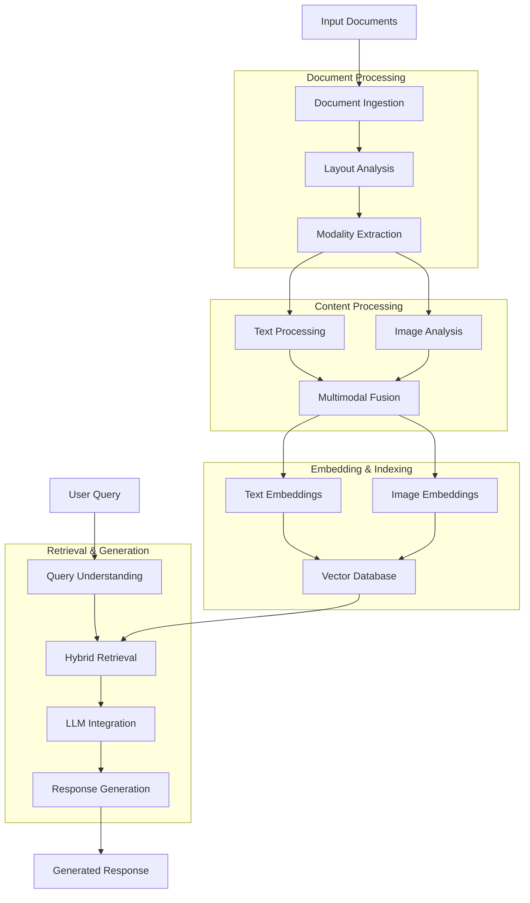
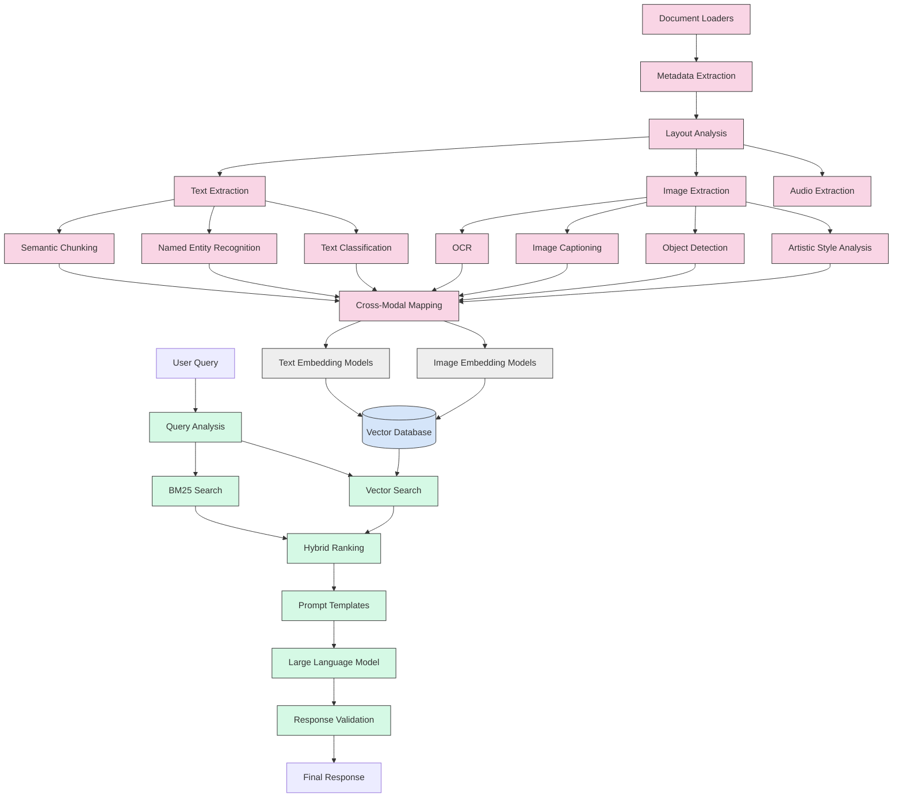
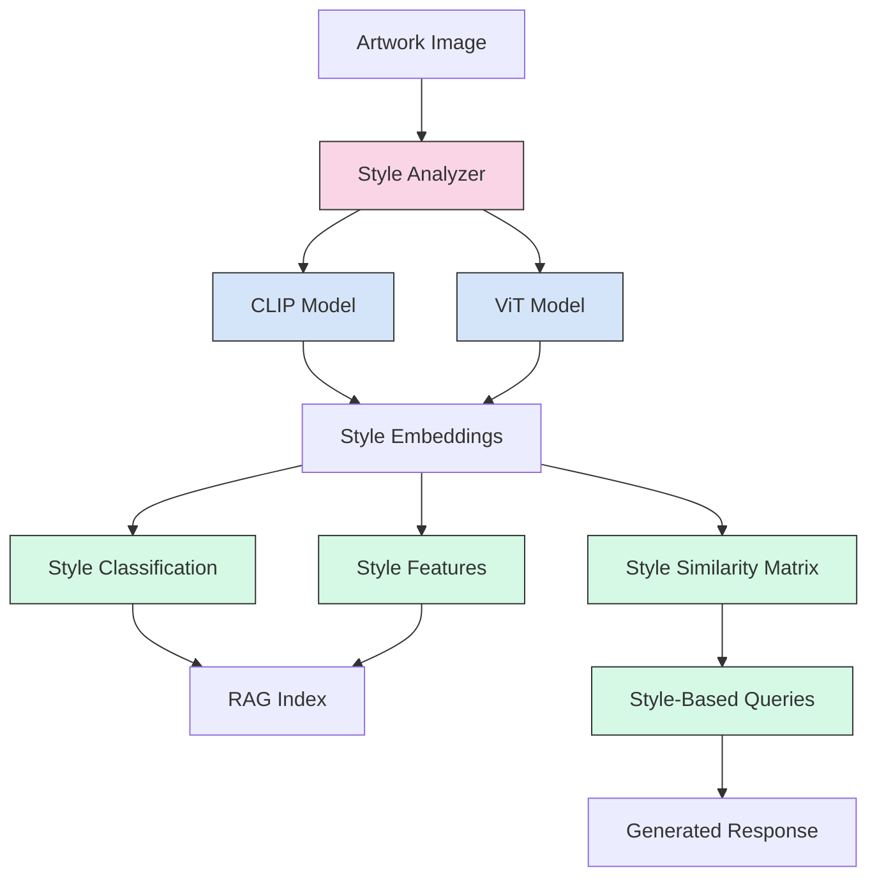
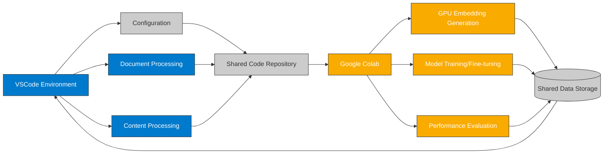

# Multimodal RAG Pipeline Architecture

This document provides a visual representation of the Multimodal RAG Pipeline architecture, showing how different components interact to process documents with text, images, audio, and complex layouts.

## High-Level Architecture



## Detailed Component View



## Artistic Style Analysis Integration



## VSCode/Colab Hybrid Workflow



## Data Flow Diagram

```mermaid
flowchart TD
    subgraph Input
        PDF[PDF Documents]
        DOCX[DOCX Documents]
        HTML[HTML Documents]
        Images[Image Files]
        Audio[Audio Files]
    end
    
    subgraph Processing
        DocLoader[Document Loaders]
        LayoutEngine[Layout Analysis Engine]
        TextProc[Text Processor]
        ImageProc[Image Processor]
        AudioProc[Audio Processor]
        Fusion[Multimodal Fusion]
    end
    
    subgraph Embedding
        TextEmbed[Text Embedding Models]
        ImageEmbed[Image Embedding Models]
        AudioEmbed[Audio Embedding Models]
    end
    
    subgraph Storage
        VectorDB[(Vector Database)]
        MetadataDB[(Metadata Store)]
    end
    
    subgraph Retrieval
        QueryProc[Query Processor]
        HybridSearch[Hybrid Search]
        Reranker[Result Reranker]
    end
    
    subgraph Generation
        PromptEng[Prompt Engineering]
        LLM[Large Language Model]
        ResponseGen[Response Generator]
    end
    
    PDF --> DocLoader
    DOCX --> DocLoader
    HTML --> DocLoader
    Images --> DocLoader
    Audio --> DocLoader
    
    DocLoader --> LayoutEngine
    LayoutEngine --> TextProc
    LayoutEngine --> ImageProc
    LayoutEngine --> AudioProc
    
    TextProc --> Fusion
    ImageProc --> Fusion
    AudioProc --> Fusion
    
    Fusion --> TextEmbed
    Fusion --> ImageEmbed
    Fusion --> AudioEmbed
    
    TextEmbed --> VectorDB
    ImageEmbed --> VectorDB
    AudioEmbed --> VectorDB
    
    Fusion --> MetadataDB
    
    UserQuery[User Query] --> QueryProc
    QueryProc --> HybridSearch
    VectorDB --> HybridSearch
    MetadataDB --> HybridSearch
    
    HybridSearch --> Reranker
    Reranker --> PromptEng
    PromptEng --> LLM
    LLM --> ResponseGen
    ResponseGen --> FinalResponse[Final Response]